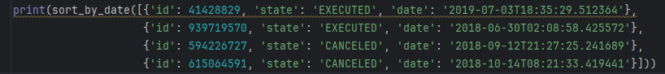

# Банковские карты
## Описание:

Данный проект  создан для операций с банковскими картами и счетами. Умеет максировать счет и номер карты, сортировать 


## Установка:
1. Клонируйте репозитории 
```
https://github.com/IKseniaShcherbakovaI/pycharm.git
```

2. Установите зависимости:
```
pip install -r requirements.txt
```

## Исползование:
1. Вызовите необходимые функции через **print** вписав в скобках необходимую функцию и передаваемые значения.


2. Запустите код с помощью данной кнопки находящейся в правом верхнем углу

     

или нажав комбинацию клавиш **Shift+F10**

3. Посмотрите на полученный результат в терминале
