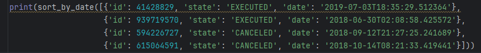

# Банковские карты
## Описание:

Данный проект  создан для операций с банковскими картами и счетами. Умеет максировать счет и номер карты, сортировать 


## Установка:
1. Клонируйте репозитории 
```
https://github.com/IKseniaShcherbakovaI/pycharm.git
```

2. Установите зависимости:
```
pip install -r requirements.txt
```
## Модули и их функции

### №1 generators
в этом модуле реализуются 3 функции
1) **filter_by_currency**
2) 
Функция выдающая список тразакций по определенной валюте

принимает 2 аргумента: список словарей (transactions) и валюта (state)
и выдает соответствующий валюте список операций

пример вызова функции:
```
usd_transactions = filter_by_currency(transactions, "USD")
for _ in range(2):
    print(next(usd_transactions))
```    
получаемый результат:
```
{'id': 939719570, 'state': 'EXECUTED', 'date': '2018-06-30T02:08:58.425572', 'operationAmount': {'amount': '9824.07', 'currency': {'name': 'USD', 'code': 'USD'}}, 'description': 'Перевод организации', 'from': 'Счет 75106830613657916952', 'to': 'Счет 11776614605963066702'}
{'id': 142264268, 'state': 'EXECUTED', 'date': '2019-04-04T23:20:05.206878', 'operationAmount': {'amount': '79114.93', 'currency': {'name': 'USD', 'code': 'USD'}}, 'description': 'Перевод со счета на счет', 'from': 'Счет 19708645243227258542', 'to': 'Счет 75651667383060284188'}
```
2) **transaction_descriptions**

Функция возвращающая описание по каждой операции

функция принимает на вход список словарей, и выдает описание операций

пример вызова функции:
```commandline
descriptions = transaction_descriptions(transactions)
for _ in range(5):
    print(next(descriptions))
```
получаемый результат:
```commandline
Перевод организации
Перевод со счета на счет
Перевод со счета на счет
Перевод с карты на карту
Перевод организации
```
3) **card_number_generator**

Функция генерирующая номер карт в заданном диапазоне

Принимает заданный диапазон в два аргумента *start* и *stop*, результато мработы функции является номер карты который 
она генерирует 

пример вызова функции:
```commandline
for card_number in card_number_generator(1, 5):
    print(card_number)
```
получаемый результат:
```commandline
0000 0000 0000 0001
0000 0000 0000 0002
0000 0000 0000 0003
0000 0000 0000 0004
0000 0000 0000 0005
```
### №2 masks

1) **get_mask_card_number**

Функция маскирующая номер карты

принимает 1 аргумент - номер карты, на выходе мы получаем замаскированный номер карты.


пример вызова функции:
```commandline
print(get_mask_card_number("7000792289606361"))
```
получаемый результат:
```commandline
7000 79** **** 6361
```

2) **get_mask_account**

Функция маскирующая номер счета
в качетве аргумента принимает номер счета, выдает его маску

пример вызова функции:
```commandline
print(get_mask_account("73654108430135874305"))
```
получаемый результат:
```commandline
**4305
```

### №3 processing

1) **filter_by_state**

Функция возвращающая новый список словарей, содержащий только те словари, у которых ключ
state соответствует указанному значению.

Принимает два аргумента *incoming_list* - список словарей, и *state* - ключ,
у которого есть два значения "EXECUTED" или "CANCELED".
на выводе мы получаем список словарей с соответсвующим значением *state*

пример вызова функции:
```commandline
print(filter_by_state([{'id': 41428829, 'state': 'EXECUTED', 'date': '2019-07-03T18:35:29.512364'}, {'id': 939719570, 'state': 'EXECUTED', 'date': '2018-06-30T02:08:58.425572'}, {'id': 594226727, 'state': 'CANCELED', 'date': '2018-09-12T21:27:25.241689'}, {'id': 615064591, 'state': 'CANCELED', 'date': '2018-10-14T08:21:33.419441'}] ,state="EXECUTED"))
```
получаемый результат:
```commandline
[{'id': 41428829, 'state': 'EXECUTED', 'date': '2019-07-03T18:35:29.512364'}, {'id': 939719570, 'state': 'EXECUTED', 'date': '2018-06-30T02:08:58.425572'}]

```
2) **sort_by_date**

Функция сортирующая список словарей по дате

Функция принимает два аргумента: *incoming_list* - список словарей, и *ascending* -  способ сортировки. 
По умолчанию стоит сортировка по убыванию, т. е. сначала самые последние операции, но ее можно поменять вписав при 
вызове функции в аргумент *ascending* - True 

пример вызова функции:
```commandline
print(sort_by_date([{'id': 41428829, 'state': 'EXECUTED', 'date': '2019-07-03T18:35:29.512364'}, {'id': 939719570, 'state': 'EXECUTED', 'date': '2018-06-30T02:08:58.425572'}, {'id': 594226727, 'state': 'CANCELED', 'date': '2018-09-12T21:27:25.241689'}, {'id': 615064591, 'state': 'CANCELED', 'date': '2018-10-14T08:21:33.419441'}] ,ascending=False))
```
получаемый результат:
```commandline
[{'id': 41428829, 'state': 'EXECUTED', 'date': '2019-07-03T18:35:29.512364'}, {'id': 615064591, 'state': 'CANCELED', 'date': '2018-10-14T08:21:33.419441'}, {'id': 594226727, 'state': 'CANCELED', 'date': '2018-09-12T21:27:25.241689'}, {'id': 939719570, 'state': 'EXECUTED', 'date': '2018-06-30T02:08:58.425572'}]

```

### №4 widget 

1) **mask_account_card**

Функция возвращающая как маску карты так и маску счета

Данная функция взаимодействует с функциями написанными в **masks**

Функция принимает один аргумент в виде строки, которые имеет в себе название карты или счета и их номер.


пример вызова функции:
```commandline
номер карты:
print(mask_account_card("Maestro 1596837868705199"))
номер счета:
print(mask_account_card("Счет 64686473678894779589"))

```
получаемый результат:
```commandline
маска номера карты:
Maestro 1596 83** **** 5199
маска номера счета: 
Счет **9589
```

2) **get_date**

Функция возвращающая дату в привычном для глаз виде

принимает один аргумент, выводит дату в формате ДД.ММ.ГГГГ

пример вызова функции:
```commandline
print(get_date("2024-03-11T02:26:18.671407"))
```
получаемый результат:
```commandline
11.03.2024
```


## Исползование:
1. Вызовите необходимые функции через **print** вписав в скобках необходимую функцию и передаваемые значения.


2. Запустите код с помощью данной кнопки находящейся в правом верхнем углу

     

или нажав комбинацию клавиш **Shift+F10**

3. Посмотрите на полученный результат в терминале


## Тестирование
В данном проекте используется фреймворк тестирования **pytest**

#### Для запуска тестирования используйте команду:
```commandline
pytest
```